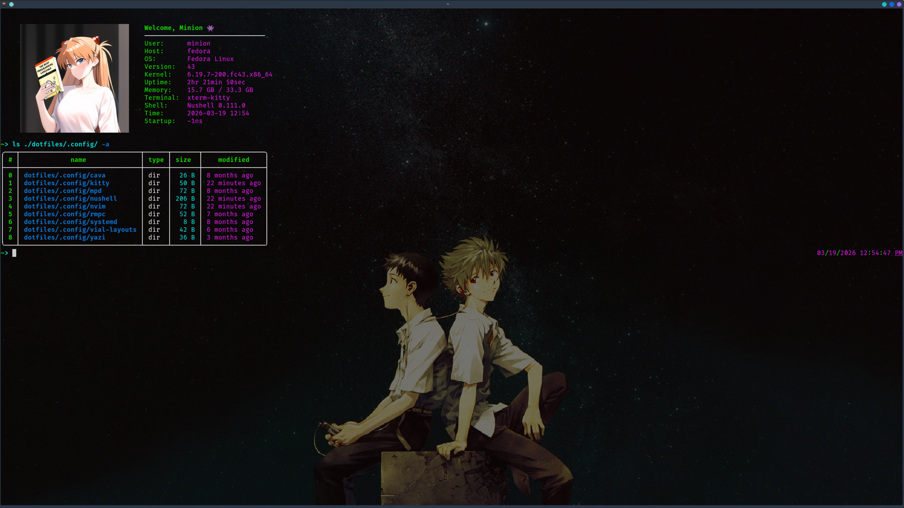

# dotfiles

Personal Linux-first dotfiles managed with **GNU Stow**.

This repo bundles my everyday terminal, editor, shell, file manager, music, and keyboard setup. The main stack currently includes:

- **Nushell** for shell configuration and helper commands
- **Neovim** with Lazy-based plugin management
- **Kitty** as the terminal emulator
- **Yazi** for terminal file management
- **MPD + rmpc + cava** for local music playback and visualization
- **systemd user units** for user-level services
- **Vial layouts** for keyboard mappings
- local **assets** such as wallpapers and profile pictures




## Structure

```text
.
├── .config/
│   ├── cava/
│   ├── kitty/
│   ├── mpd/
│   ├── nushell/
│   ├── nvim/
│   ├── rmpc/
│   ├── systemd/
│   ├── vial-layouts/
│   └── yazi/
├── assets/
└── deprecated/
    ├── .local/
    └── firefox/
```

## Requirements

At minimum, install:

- `git`
- `stow`

Depending on what parts of the repo you want to use, you may also want:

- `nushell`
- `neovim`
- `kitty`
- `yazi`
- `mpd`
- `rmpc`
- `cava`
- `zoxide`
- `fnm`
- `bun`
- `sdkman`
- `flutter`
- `ripgrep`
- `fzf`
- `make`
- `lazygit`
- `atac`
- `vial`

## Installation

Clone the repo into your home directory so Stow can manage it as a package:

```bash
git clone git@github.com:PolvosMagicos/dotfiles.git ~/dotfiles
cd ~
stow dotfiles
```

If you want to preview what Stow will do first:

```bash
stow -nv dotfiles
```

To remove the symlinks later:

```bash
cd ~
stow -D dotfiles
```

## What gets stowed

The repo is set up so the package root is the repository itself. Running `stow dotfiles` from your home directory will symlink files like:

- `~/dotfiles/.config/nvim` -> `~/.config/nvim`
- `~/dotfiles/.config/kitty` -> `~/.config/kitty`
- `~/dotfiles/.config/nushell` -> `~/.config/nushell`
- `~/dotfiles/.config/yazi` -> `~/.config/yazi`

Some paths are intentionally excluded through `.stow-local-ignore`, including:

- `.git`
- `.gitignore`
- `README*`
- `assets/`
- `deprecated/`

Those folders are meant to stay in the repo and be used manually, if at all.

## Notable configs

### Nushell

The Nushell setup includes:

- custom PATH bootstrapping helpers
- `zoxide` integration
- `yazi` wrapper to `cd` into the last visited directory
- `fnm`, Bun, Java, Android SDK, Flutter, Cargo, and common user bin paths
- a custom banner loaded from `env.nu`

There are also NixOS helper commands under `~/.config/nushell/scripts/nixos-commands.nu`:

- `nsw` → `nixos-rebuild switch`
- `nboot` → `nixos-rebuild boot`
- `ntest` → `nixos-rebuild test`
- `nupdate` → flake update + rebuild
- `nclean` → garbage collection

### Neovim

The Neovim config is organized under `lua/polvos-magicos` and includes:

- Catppuccin theme
- Treesitter
- Telescope and extensions
- ToggleTerm
- Yanky
- Todo Comments
- TypeScript tools
- custom ISML filetype registration

### MPD stack

This repo includes:

- `mpd` config and state paths
- `rmpc` config
- a `systemd --user` unit for MPD
- `cava` config and shaders

### Keyboard layouts

Vial layout files are stored in `.config/vial-layouts/`.

## Assets and deprecated files

The `assets/` and `deprecated/` directories are not managed by Stow.

- `assets/` contains wallpapers and profile pictures
- `deprecated/` contains old files I no longer actively use, including previous `.local` entries and Firefox customization files

Keep them in the repo for reference, or copy from them manually only if needed.

## Machine-specific files

A few files in the repo are naturally machine-generated or machine-specific, such as:

- `.config/nushell/history.txt`
- `.config/nushell/oldconfig-*`
- `.config/nushell/oldenv-*`
- `.config/mpd/database/`
- `.config/mpd/log/`
- `.config/mpd/pid`
- `.config/mpd/state/`
- desktop entries stored under `deprecated/.local/share/applications/`

Some generated MPD and Nushell files are already ignored in `.gitignore`, but you may still want to prune or sanitize machine-specific data before sharing the repo publicly.

## Platform notes

This setup is primarily tailored for Linux, with some paths that also make room for macOS/Homebrew. A few commands are specifically NixOS-oriented, if it's cloned on NixOS, stow should be replaced by declarative symlinks on `home.nix`.
